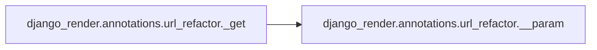
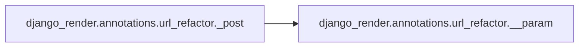
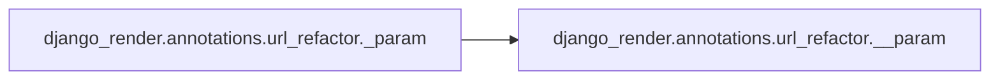
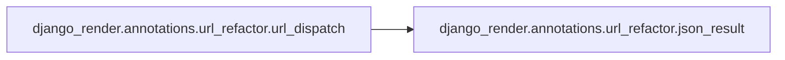

# Django Render Annotations

[_Documentation generated by Documatic_](https://www.documatic.com)

<!---Documatic-section-Codebase Structure-start--->
## Codebase Structure

<!---Documatic-block-system_architecture-start--->
```mermaid
None
```
<!---Documatic-block-system_architecture-end--->

# #
<!---Documatic-section-Codebase Structure-end--->

<!---Documatic-section-django_render.annotations.url_refactor._login_required-start--->
## django_render.annotations.url_refactor._login_required

<!---Documatic-section-_login_required-start--->
<!---Documatic-block-django_render.annotations.url_refactor._login_required-start--->
<details>
	<summary><code>django_render.annotations.url_refactor._login_required</code> code snippet</summary>

```python
def _login_required(is_ajax=False, access_secret_key=None, read_user_interceptor=None, login_page=None, check_auth=None):

    def paramed_decorator(func):

        @functools.wraps(func)
        def decorated(*args, **kwargs):
            if is_ajax:
                response = HttpResponse(json.dumps({'rt': False, 'message': 'login first'}, separators=(',', ':')), content_type=CONTENT_TYPE_JSON)
            else:
                response = HttpResponseRedirect(login_page)
            request = args[0]
            if hasattr(request, 'user') and request.user.is_authenticated() or access_secret_key == request.GET.get('access_secret_key', ''):
                return func(*args, **kwargs)
            user = read_user_interceptor(request)
            if user is None:
                return response
            else:
                if check_auth is not None:
                    if check_auth(request, user):
                        pass
                    else:
                        return HttpResponse(json.dumps({'rt': False, 'message': 'Permission Denied!'}, separators=(',', ':')), content_type=CONTENT_TYPE_JSON)
                if sys.version > '3':
                    co_varnames = func.__code__.co_varnames
                else:
                    co_varnames = func.func_code.co_varnames
                if 'user' in co_varnames:
                    kwargs.update({'user': user})
            return func(*args, **kwargs)
        return decorated
    if read_user_interceptor is None:
        if global_read_user_interceptor is not None:
            read_user_interceptor = global_read_user_interceptor
        else:
            read_user_interceptor = lambda request: None
    if access_secret_key is None:
        if global_access_secret_key is not None:
            access_secret_key = global_access_secret_key
    if login_page is None:
        if global_login_page is not None:
            login_page = global_login_page
        else:
            login_page = 'login'
    return paramed_decorator
```
</details>
<!---Documatic-block-django_render.annotations.url_refactor._login_required-end--->
<!---Documatic-section-_login_required-end--->

# #
<!---Documatic-section-django_render.annotations.url_refactor._login_required-end--->

<!---Documatic-section-django_render.annotations.url_refactor.__param-start--->
## django_render.annotations.url_refactor.__param

<!---Documatic-section-__param-start--->
<!---Documatic-block-django_render.annotations.url_refactor.__param-start--->
<details>
	<summary><code>django_render.annotations.url_refactor.__param</code> code snippet</summary>

```python
def __param(method_name, *p_args, **p_kwargs):

    def paramed_decorator(func):

        @functools.wraps(func)
        def decorated(*args, **kwargs):
            request = args[0]
            req_param = deepcopy(request.GET)
            req_param.update(request.POST)
            m = {'get': request.GET, 'post': request.POST, 'param': req_param}
            method = m[method_name]
            for (k, v) in p_kwargs.items():
                _name = None
                _type = None
                _default = None
                if type(v) == str:
                    _type = str
                    _name = v
                elif type(v) == dict:
                    if 'name' in v:
                        _name = v['name']
                    if 'type' in v:
                        _type = v['type']
                    if 'default' in v:
                        _default = v['default']
                elif type(v) == tuple and len(v) == 3:
                    _name = v[0]
                    _type = v[1]
                    _default = v[2]
                elif type(v) == tuple and len(v) == 2:
                    _type = v[0]
                    _default = v[1]
                elif type(v) == type:
                    _type = v
                elif v in (_Type.str_list, _Type.int_list, _Type.json, _Type.file):
                    _type = v
                if _name is None:
                    _name = k
                if _type is None:
                    _type = str
                has_key = True
                try:
                    if _type == _Type.file:
                        if method_name != 'post':
                            return HttpResponse(json.dumps({'rt': False, 'message': 'The file parameter <{}> should in POST method'.format(_name)}, separators=(',', ':')), content_type=CONTENT_TYPE_JSON)
                        origin_v = request.FILES.get(_name, None)
                    else:
                        origin_v = ','.join(method.getlist(_name)).strip()
                        if len(origin_v) == 0:
                            has_key = False
                except KeyError:
                    has_key = False
                if has_key:
                    if _type == bool:
                        origin_v = origin_v.lower()
                        if origin_v == 'false' or origin_v == '0' or origin_v == 'off':
                            value = False
                        elif origin_v == 'true' or origin_v == 'on':
                            value = True
                        else:
                            value = bool(origin_v)
                    elif _type == _Type.str_list:
                        value = [item for item in origin_v.split(',') if len(item) > 0]
                    elif _type == _Type.int_list:
                        value = [int(item) for item in origin_v.split(',')]
                    elif _type == _Type.json:
                        try:
                            value = json.loads(origin_v)
                        except ValueError:
                            return HttpResponse(json.dumps({'rt': False, 'message': 'No JSON object could be decoded'}, separators=(',', ':')), content_type=CONTENT_TYPE_JSON)
                    elif _type == _Type.file:
                        value = origin_v
                        pass
                    elif _type == str:
                        value = origin_v
                    else:
                        value = _type(origin_v)
                elif _default is not None:
                    value = _default
                else:
                    return HttpResponse(json.dumps({'rt': False, 'message': 'Please specify the parameter : ' + _name + ';'}, separators=(',', ':')), content_type=CONTENT_TYPE_JSON)
                kwargs.update({k: value})
            for k in p_args:
                try:
                    kwargs.update({k: method[k].encode('utf-8')})
                except KeyError:
                    return HttpResponse(json.dumps({'rt': False, 'message': 'Please specify the parameter : ' + k}, separators=(',', ':')), content_type=CONTENT_TYPE_JSON)
            return func(*args, **kwargs)
        return decorated
    return paramed_decorator
```
</details>
<!---Documatic-block-django_render.annotations.url_refactor.__param-end--->
<!---Documatic-section-__param-end--->

# #
<!---Documatic-section-django_render.annotations.url_refactor.__param-end--->

<!---Documatic-section-django_render.annotations.url_refactor._get-start--->
## django_render.annotations.url_refactor._get

<!---Documatic-section-_get-start--->


### Object Calls

* django_render.annotations.url_refactor.__param

<!---Documatic-block-django_render.annotations.url_refactor._get-start--->
<details>
	<summary><code>django_render.annotations.url_refactor._get</code> code snippet</summary>

```python
def _get(*p_args, **p_kwargs):
    return __param('get', *p_args, **p_kwargs)
```
</details>
<!---Documatic-block-django_render.annotations.url_refactor._get-end--->
<!---Documatic-section-_get-end--->

# #
<!---Documatic-section-django_render.annotations.url_refactor._get-end--->

<!---Documatic-section-django_render.annotations.url_refactor._post-start--->
## django_render.annotations.url_refactor._post

<!---Documatic-section-_post-start--->


### Object Calls

* django_render.annotations.url_refactor.__param

<!---Documatic-block-django_render.annotations.url_refactor._post-start--->
<details>
	<summary><code>django_render.annotations.url_refactor._post</code> code snippet</summary>

```python
def _post(*p_args, **p_kwargs):
    return __param('post', *p_args, **p_kwargs)
```
</details>
<!---Documatic-block-django_render.annotations.url_refactor._post-end--->
<!---Documatic-section-_post-end--->

# #
<!---Documatic-section-django_render.annotations.url_refactor._post-end--->

<!---Documatic-section-django_render.annotations.url_refactor._files-start--->
## django_render.annotations.url_refactor._files

<!---Documatic-section-_files-start--->
<!---Documatic-block-django_render.annotations.url_refactor._files-start--->
<details>
	<summary><code>django_render.annotations.url_refactor._files</code> code snippet</summary>

```python
def _files(*p_args, **p_kwargs):

    def paramed_decorator(func):

        @functools.wraps(func)
        def decorated(*args, **kwargs):
            request = args[0]
            for file_name in p_args:
                fp = request.FILES.get(file_name, None)
                try:
                    kwargs.update({file_name: fp})
                except ValueError:
                    return HttpResponse(json.dumps({'rt': False, 'message': 'Please specify the parameter : ' + file_name}, separators=(',', ':')), content_type=CONTENT_TYPE_JSON)
                except KeyError:
                    return HttpResponse(json.dumps({'rt': False, 'message': 'Please specify the parameter : ' + file_name}, separators=(',', ':')), content_type=CONTENT_TYPE_JSON)
            return func(*args, **kwargs)
        return decorated
    return paramed_decorator
```
</details>
<!---Documatic-block-django_render.annotations.url_refactor._files-end--->
<!---Documatic-section-_files-end--->

# #
<!---Documatic-section-django_render.annotations.url_refactor._files-end--->

<!---Documatic-section-django_render.annotations.url_refactor._param-start--->
## django_render.annotations.url_refactor._param

<!---Documatic-section-_param-start--->


### Object Calls

* django_render.annotations.url_refactor.__param

<!---Documatic-block-django_render.annotations.url_refactor._param-start--->
<details>
	<summary><code>django_render.annotations.url_refactor._param</code> code snippet</summary>

```python
def _param(*p_args, **p_kwargs):
    return __param('param', *p_args, **p_kwargs)
```
</details>
<!---Documatic-block-django_render.annotations.url_refactor._param-end--->
<!---Documatic-section-_param-end--->

# #
<!---Documatic-section-django_render.annotations.url_refactor._param-end--->

<!---Documatic-section-django_render.annotations.url_refactor.url_dispatch-start--->
## django_render.annotations.url_refactor.url_dispatch

<!---Documatic-section-url_dispatch-start--->


### Object Calls

* django_render.annotations.url_refactor.json_result

<!---Documatic-block-django_render.annotations.url_refactor.url_dispatch-start--->
<details>
	<summary><code>django_render.annotations.url_refactor.url_dispatch</code> code snippet</summary>

```python
def url_dispatch(request, *args, **kwargs):
    url_pattern = kwargs.pop('url_pattern', None)
    is_json = kwargs.pop('is_json', False)
    method_mapping = url_mapping.get(url_pattern, None)
    if method_mapping is None:
        raise Http404
    view = method_mapping.get(request.method, None)
    if view is not None:
        rt = view(request, *args, **kwargs)
        logging.debug(type(rt))
        is_json = is_json or not issubclass(type(rt), HttpResponse)
        logging.debug(is_json)
        if is_json:
            return json_result(rt)
        return rt
    else:
        return HttpResponse(status=403, content='Request Forbidden 403')
```
</details>
<!---Documatic-block-django_render.annotations.url_refactor.url_dispatch-end--->
<!---Documatic-section-url_dispatch-end--->

# #
<!---Documatic-section-django_render.annotations.url_refactor.url_dispatch-end--->

<!---Documatic-section-django_render.annotations.url_refactor._url-start--->
## django_render.annotations.url_refactor._url

<!---Documatic-section-_url-start--->
<!---Documatic-block-django_render.annotations.url_refactor._url-start--->
<details>
	<summary><code>django_render.annotations.url_refactor._url</code> code snippet</summary>

```python
def _url(url_pattern, method=None, is_json=False, *p_args, **p_kwargs):
    if method is None:
        method = [_M.POST, _M.GET]

    def paramed_decorator(func):

        @functools.wraps(func)
        def decorated(self, *args, **kwargs):
            return func(self, *args, **kwargs)
        url_key = func.__module__ + url_pattern
        mapping = url_mapping.get(url_key, None)
        if mapping is None:
            url_mapping.update({url_key: {}})
        if type(method) in (list, tuple, set):
            for m in method:
                url_mapping[url_key].update({m: decorated})
        else:
            url_mapping[url_key].update({method: decorated})
        module = sys.modules[func.__module__]
        if not hasattr(module, 'urlpatterns'):
            module.urlpatterns = []
        module.urlpatterns.append(django_url(url_pattern, url_dispatch, {'url_pattern': url_key, 'is_json': is_json}, *p_args, **p_kwargs))
        return decorated
    return paramed_decorator
```
</details>
<!---Documatic-block-django_render.annotations.url_refactor._url-end--->
<!---Documatic-section-_url-end--->

# #
<!---Documatic-section-django_render.annotations.url_refactor._url-end--->

<!---Documatic-section-django_render.annotations.url_refactor.json_result-start--->
## django_render.annotations.url_refactor.json_result

<!---Documatic-section-json_result-start--->
<!---Documatic-block-django_render.annotations.url_refactor.json_result-start--->
<details>
	<summary><code>django_render.annotations.url_refactor.json_result</code> code snippet</summary>

```python
def json_result(rt):
    response = HttpResponse(content_type=CONTENT_TYPE_JSON)
    if type(rt) == tuple:
        status = rt[0]
        if status:
            rt_obj = {'rt': status}
            rt_obj.update(rt[1])
            response.content = json.dumps(rt_obj, separators=(',', ':'))
            return response
        else:
            if isinstance(rt[1], Enum):
                response.content = json.dumps({'rt': status, 'message': rt[1].value}, separators=(',', ':'))
            else:
                response.content = json.dumps({'rt': status, 'message': rt[1]}, separators=(',', ':'))
            return response
    elif type(rt) is bool:
        response.content = json.dumps({'rt': rt, 'message': ''}, separators=(',', ':'))
        return response
    elif type(rt) is dict:
        response.content = json.dumps(rt, separators=(',', ':'))
        return response
    elif type(rt) is list:
        response.content = json.dumps(rt, separators=(',', ':'))
        return response
    elif type(rt) is HttpResponse:
        response = rt
        return response
    elif rt is None:
        response.content = json.dumps({}, separators=(',', ':'))
        return response
    else:
        response.content = json.dumps({'message': str(rt)}, separators=(',', ':'))
        return response
```
</details>
<!---Documatic-block-django_render.annotations.url_refactor.json_result-end--->
<!---Documatic-section-json_result-end--->

# #
<!---Documatic-section-django_render.annotations.url_refactor.json_result-end--->

[_Documentation generated by Documatic_](https://www.documatic.com)